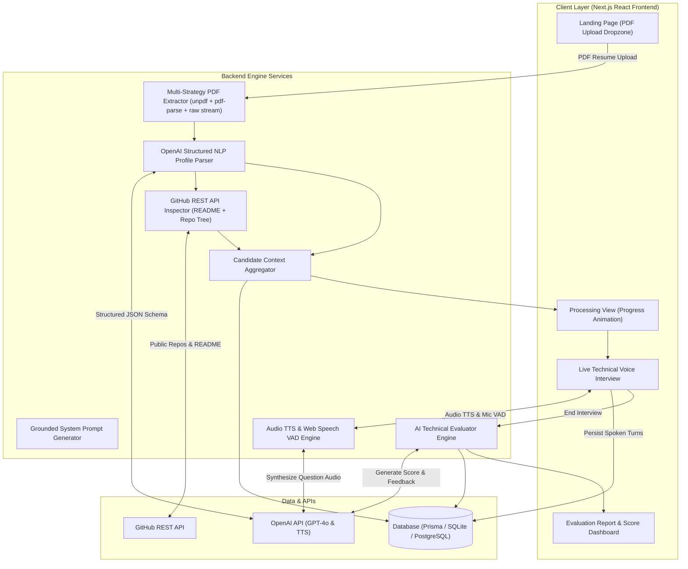

# IntervAI — Resume-Grounded AI Technical Interviewer

> **"Upload your resume. IntervAI understands your projects and conducts a real-time technical voice interview about your own experience."**

[](https://nextjs.org/)
[](https://www.typescriptlang.org/)
[](https://platform.openai.com/)
[](https://www.prisma.io/)
[](https://docs.github.com/en/rest)

---

## 🌟 Executive Overview

**IntervAI** is a full-stack, voice-first AI technical interviewer designed to eliminate generic textbook mock interview questions. Instead of selecting broad topics like DSA, DBMS, or NLP, IntervAI inspects the candidate's actual PDF resume and publicly linked GitHub repositories (extracting `README.md` documentation and codebase file structure) to build a normalized **Candidate Context Dossier**.

The interviewer conducts a live voice conversation—speaking every question aloud and using automatic Voice Activity Detection (VAD) to listen to candidate answers through the microphone—probing system architecture, design trade-offs, edge cases, and scalability.

---

## 🚀 Key Highlights & Differentiators

* 🎯 **100% Resume-Grounded Probing:** Zero generic quiz questions. Every question directly references explicit resume claims, project descriptions, GitHub README content, or candidate responses.
* 🐙 **GitHub Repository Deep Dive:** Automatically validates public GitHub URLs, extracts repository metadata, parses `README.md`, and retrieves codebase file tree structure.
* 🎙️ **Voice-First Interactive Experience:** Speaks every question aloud via Text-to-Speech (`/api/tts` & Web Speech API) and listens through candidate microphone with automated 1.8s silence VAD turn detection.
* 🏛️ **Big-Tech Interview Patterns:** Probing levels inspired by Google, Amazon, Meta, Microsoft, Apple, OpenAI, and Big Four technical interviews (Overview $\rightarrow$ Implementation $\rightarrow$ Architecture/Design Choice $\rightarrow$ Alternatives/Trade-offs $\rightarrow$ Failure/Edge Cases $\rightarrow$ Scalability/Performance).
* 📊 **Comprehensive AI Evaluation Report:** Generates an overall technical score (0–100), key strengths, areas for improvement, and detailed question-by-question grounded feedback.

---

## 📐 System Architecture & Flow



---

## 🛠️ Feature Deep Dive

### 1. Multi-Strategy PDF Text Extractor
Located in [`src/lib/nlp/resumeParser.ts`](file:///c:/Users/amoli/OneDrive/Desktop/IntervAI/src/lib/nlp/resumeParser.ts), text extraction uses a 3-tier fallback hierarchy ensuring 100% extraction reliability across all PDF versions:
1. **Stage 1 (Primary):** `unpdf` (Modern PDF.js engine without native canvas bindings).
2. **Stage 2 (Secondary):** `pdf-parse/lib/pdf-parse.js` direct engine fallback.
3. **Stage 3 (Tertiary):** Raw binary stream string object extractor.

### 2. GitHub Public Repository Inspection Matrix
Located in [`src/lib/github/githubService.ts`](file:///c:/Users/amoli/OneDrive/Desktop/IntervAI/src/lib/github/githubService.ts):
- Parses GitHub links and extracts repository owner & name.
- Retrieves `README.md` and strips raw HTML comments/badges to fit into context window.
- Fetches directory tree (`git/trees`) for file structure context.
- Fallback hierarchy: `resume+github_readme` $\rightarrow$ `resume+github_tree` $\rightarrow$ `resume_only`.

### 3. Voice Engine & Turn Detection (VAD)
Located in [`src/lib/voice/speechEngine.ts`](file:///c:/Users/amoli/OneDrive/Desktop/IntervAI/src/lib/voice/speechEngine.ts):
- **Audio Output:** Plays spoken question aloud via `/api/tts` (OpenAI `tts-1` `alloy` voice) or client Web Speech API (`window.speechSynthesis`).
- **Microphone Input:** SpeechRecognition STT capturing candidate answer in real-time.
- **VAD Turn Detection:** 1.8 seconds of silence after candidate speaks automatically finalizes transcript, transitions state to `PROCESSING_ANSWER`, and submits to backend.

---

## 🗄️ Database Schema (Prisma)

Managed via [`prisma/schema.prisma`](file:///c:/Users/amoli/OneDrive/Desktop/IntervAI/prisma/schema.prisma):

```
+----------------+       1:N       +----------------+       1:N       +-----------------+
|      User      | --------------->|     Resume     | --------------->|     Project     |
+----------------+                 +----------------+                 +-----------------+
        |                                  |                                   |
        | 1:N                              | 1:N                               | 1:N
        v                                  v                                   v
+----------------+                 +----------------+                 +-----------------+
|   Interview    |<----------------| ProjectSource  |                 |InterviewQuestion|
+----------------+                 +----------------+                 +-----------------+
  |        |                                                                   |
  | 1:1    | 1:N                                                               | 1:1
  v        v                                                                   v
+----+  +---------------+                                             +-----------------+
|Eval|  |InterviewAnswer|<--------------------------------------------|InterviewAnswer  |
+----+  +---------------+                                             +-----------------+
```

---

## 🔌 API Map Reference

| Endpoint | Method | Description |
| :--- | :--- | :--- |
| `/api/resume/upload` | `POST` | Uploads PDF resume, extracts text, executes NLP parsing, inspects GitHub repos, saves DB models. |
| `/api/interview/start` | `POST` | Compiles CandidateContext and initializes `Interview` record. |
| `/api/interview/session` | `POST` | Returns session configuration and system instructions. |
| `/api/interview/answer` | `POST` | Persists a single question & candidate transcript turn to DB. |
| `/api/tts` | `POST` | Generates MP3 audio for AI spoken questions using OpenAI TTS. |
| `/api/interview/end` | `POST` | Finalizes interview and triggers AI Evaluation Engine. |
| `/api/interview/[id]/results` | `GET` | Fetches overall score, strengths, areas for improvement, per-question analysis, and transcript. |

---

## 📂 Project Structure

```
IntervAI/
├── prisma/
│   └── schema.prisma              # Prisma ORM Database Models
├── src/
│   ├── app/
│   │   ├── api/
│   │   │   ├── resume/upload/     # PDF Upload & NLP Processing API
│   │   │   ├── interview/start/   # Session Initialization API
│   │   │   ├── interview/session/ # Realtime Session Configuration API
│   │   │   ├── interview/answer/  # Turn Persistence API
│   │   │   ├── interview/end/     # Evaluation Trigger API
│   │   │   ├── interview/[id]/results/ # Evaluation Results API
│   │   │   └── tts/               # Text-To-Speech Audio API
│   │   ├── interview/[id]/        # Live Voice Interview Screen
│   │   ├── processing/[id]/       # Context Processing Screen
│   │   ├── results/[id]/          # Assessment & Report Screen
│   │   ├── globals.css            # Dark Mode & Glassmorphism Design System
│   │   ├── layout.tsx             # Root Application Layout
│   │   └── page.tsx               # Landing Page & Resume Upload Dropzone
│   └── lib/
│       ├── db.ts                  # Prisma Client Singleton Instance
│       ├── context/               # Candidate Context Aggregator
│       ├── github/                # GitHub REST API Service
│       ├── interviewer/           # Grounded System Prompt Generator
│       ├── nlp/                   # Resume Text Extractor & NLP Parser
│       ├── voice/                 # SpeechEngine (TTS, STT, VAD)
│       └── evaluation/            # Post-Interview AI Evaluator Engine
├── scripts/
│   └── test_runner.ts             # System Integrity & Grounding Test Suite
├── package.json                   # Dependencies & Scripts
└── README.md                      # Detailed System Documentation
```

---

## ⚡ Local Setup & Installation

### Prerequisites
* Node.js v20.x or higher
* npm / pnpm / yarn

### 1. Clone & Install Dependencies
```bash
git clone https://github.com/Amolika123/IntervAI.git
cd IntervAI
npm install
```

### 2. Environment Variables Configuration
Create a `.env.local` file in the root directory:
```env
# Database Connection (SQLite local fallback / PostgreSQL string)
DATABASE_URL="file:./dev.db"

# OpenAI API Key (Required for structured NLP, TTS audio & Evaluation)
OPENAI_API_KEY="your-openai-api-key-here"

# GitHub Token (Optional: Increases GitHub REST API rate limits)
GITHUB_TOKEN="your-github-personal-access-token"
```

### 3. Initialize Database
```bash
npx prisma db push
```

### 4. Run Development Server
```bash
npm run dev
```
Open [http://localhost:3000](http://localhost:3000) in your browser.

---

## 🧪 Testing & Verification

Run the automated system integrity test suite verifying URL parsing, candidate context aggregation, and system prompt grounding guardrails:

```bash
npx tsx scripts/test_runner.ts
```

To run a production build verification:
```bash
npm run build
```

---

## 📄 License & Attribution

Developed for **IntervAI** — Resume-Grounded AI Technical Interviewer.
